# 🏗️ Shadow Workplace - Architecture Diagram

## System Overview

Shadow Workplace simulates a real software engineering workplace using AI agents orchestrated by LangGraph. The system consists of two main workflows and multiple specialized agents.

---

## High-Level Architecture

```mermaid
graph TB
    subgraph "User Interface Layer"
        User[👤 User/Developer]
        CLI[CLI Application]
        API[FastAPI Server]
    end
    
    subgraph "Orchestration Layer - LangGraph"
        Setup[Setup Workflow]
        Review[Review Workflow]
        State[(Shared State)]
    end
    
    subgraph "Agent Layer"
        Manager[🎯 Product Owner<br/>Marcus]
        DevOps[⚙️ GitOps Agent<br/>OPS-Bot 9000]
        Security[🔒 Security Agent]
        Senior[👨‍💻 Senior Engineer<br/>Sarah]
    end
    
    subgraph "External Services"
        GitHub[🐙 GitHub API]
        Repo[(User Repository)]
        Issues[📋 GitHub Issues]
    end
    
    User -->|Selects Job Type| CLI
    CLI -->|HTTP Request| API
    API -->|Invokes| Setup
    API -->|Invokes| Review
    
    Setup --> Manager
    Setup --> DevOps
    Review --> Security
    Review --> Senior
    
    Manager -->|Generates Tickets| State
    DevOps -->|Creates Repo & Issues| GitHub
    Security -->|Scans Code| Repo
    Senior -->|Reviews PRs| Repo
    
    GitHub --> Repo
    GitHub --> Issues
    
    State -.->|Shared Context| Manager
    State -.->|Shared Context| DevOps
    State -.->|Shared Context| Security
    State -.->|Shared Context| Senior
```



---

## Workflow 1: Setup (Get Hired)

This workflow simulates the onboarding process when a user "gets hired" for a specific role.


---

## Workflow 2: Review (Security Pipeline)

This workflow is triggered when code is submitted for review (PR or push).

```mermaid
sequenceDiagram
    participant User
    participant API
    participant Security as Security Agent
    participant State as Shared State
    participant Senior as Senior Engineer Agent
    participant GitHub
    
    User->>GitHub: Push code or create PR
    User->>API: POST /agent/review_code<br/>{repo_url: "..."}
    API->>Security: Invoke with repo URL
    
    activate Security
    Security->>GitHub: Fetch code
    GitHub-->>Security: Source files
    Security->>Security: Scan for vulnerabilities<br/>- SQL injection<br/>- Hardcoded secrets<br/>- Security flaws
    
    alt Security Issues Found
        Security->>State: security_status = "blocked"
        Security-->>API: BLOCKED - Critical issues
        API-->>User: ❌ Security review failed
    else No Security Issues
        Security->>State: security_status = "clean"
        Security-->>Senior: Continue to code review
        deactivate Security
        
        activate Senior
        Senior->>GitHub: Fetch code
        GitHub-->>Senior: Source files
        Senior->>Senior: Review code quality<br/>- Best practices<br/>- Error handling<br/>- Code style<br/>- Magic numbers
        
        alt Code Has Issues
            Senior->>GitHub: Post review comments
            Senior-->>API: Changes requested
            API-->>User: 🔄 Revision needed
        else Code is Perfect
            Senior->>GitHub: Approve & merge
            Senior-->>API: LGTM
            API-->>User: ✅ Code approved!
        end
        deactivate Senior
    end
```



---

## Component Architecture


---

## Agent Responsibilities

| Agent | Module | Purpose | Key Actions |
|-------|--------|---------|-------------|
| **Product Owner (Marcus)** | `agents/manager/manager.py` | Generate sprint tasks | - Parse job type<br/>- Create 3-5 realistic tickets<br/>- Output JSON format |
| **GitOps (OPS-Bot 9000)** | `agents/devops/devops.py` | Manage GitHub infrastructure | - Create repositories<br/>- Convert tickets to GitHub issues<br/>- Report status |
| **Security Agent** | `agents/security/security.py` | Scan for vulnerabilities | - Check for SQL injection<br/>- Detect hardcoded secrets<br/>- Block if critical issues found |
| **Senior Engineer (Sarah)** | `agents/senior_dev/senior_dev.py` | Strict code review | - Enforce best practices<br/>- Check error handling<br/>- Reject messy code |

---

## Data Flow


---

## Technology Stack

- **Framework**: LangGraph (Supervisor-Worker Pattern)
- **API**: FastAPI
- **State Management**: TypedDict (Shared State)
- **Agents**: LangChain/Custom nodes
- **External APIs**: GitHub API, OpenAI/Anthropic
- **Containerization**: Docker, Docker Compose
- **Languages**: Python 3.x

---

## Deployment Architecture


---

## Key Design Patterns

1. **Supervisor-Worker Pattern**: Central orchestrator (LangGraph) manages specialized agent workers
2. **State Management**: Shared state dictionary passed between nodes
3. **Conditional Routing**: Security agent can block workflow based on scan results
4. **Separation of Concerns**: Each agent has single responsibility
5. **API-First Design**: FastAPI endpoints expose workflows to external clients

---

## Workflow States

### Setup Workflow State
```python
class SetupState(TypedDict):
    messages: List[str]  # Communication log
```

### Review Workflow State
```python
class ReviewState(TypedDict):
    repo_url: str           # Target repository
    messages: List[str]     # Review comments
    security_status: str    # "clean" or "blocked"
```

---

## Future Extensions

- Add QA/Testing Agent
- Implement CI/CD pipeline simulation
- Add metrics dashboard
- Support multiple concurrent users
- Webhook integration for automatic PR reviews
- Slack notifications for review results
